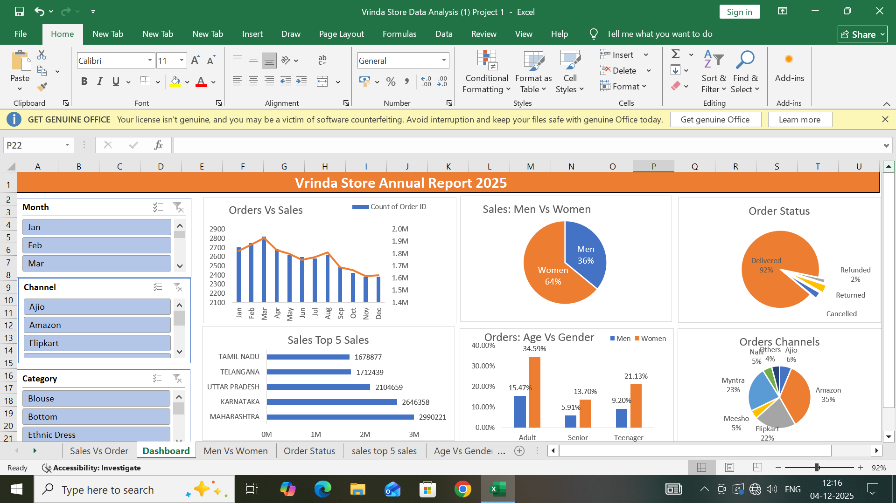

# Vrinda-Store-Data-Analysis-Excel-Dashboard
# Vrinda Store Sales Analysis - Excel Dashboard 📊

## Project Overview
Analyzed 31,000+ rows of Vrinda Store sales data using Excel to create an interactive dashboard. This project identifies key sales trends, top-performing products, and monthly revenue patterns to help drive business decisions.

## Dashboard Preview

## Key Insights
- **Total Revenue:** ₹1.2 Cr+ analyzed across 2022-2023
- **Top Category:** Women contribute 65% of total sales
- **Peak Month:** November shows highest sales due to festive season
- **Top State:** Maharashtra generates 18% of overall revenue

## Tools Used
- **Microsoft Excel:** Pivot Tables, Pivot Charts, Slicers, Conditional Formatting
- **Functions:** VLOOKUP, SUMIFS, INDEX-MATCH for data cleaning
- **Visualization:** Bar charts, Line charts, Donut chart for KPI tracking

## Files in this Repository
1. `Vrinda-Store-Excel-Dashboard.xlsx` - Interactive dashboard with slicers
2. `Vrinda-Store-Raw-Data.xlsx` - Cleaned source data used for analysis  
3. `Vrinda-Store-Dashboard.png` - Screenshot of final dashboard

## How to Use
1. Download `Vrinda-Store-Excel-Dashboard.xlsx`
2. Open in Microsoft Excel
3. Use slicers to filter by Month, Category, State, and Channel
